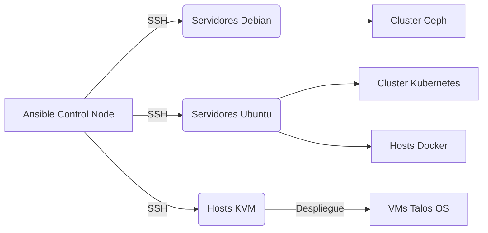
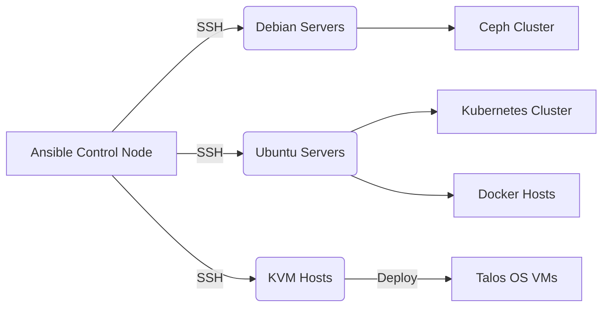
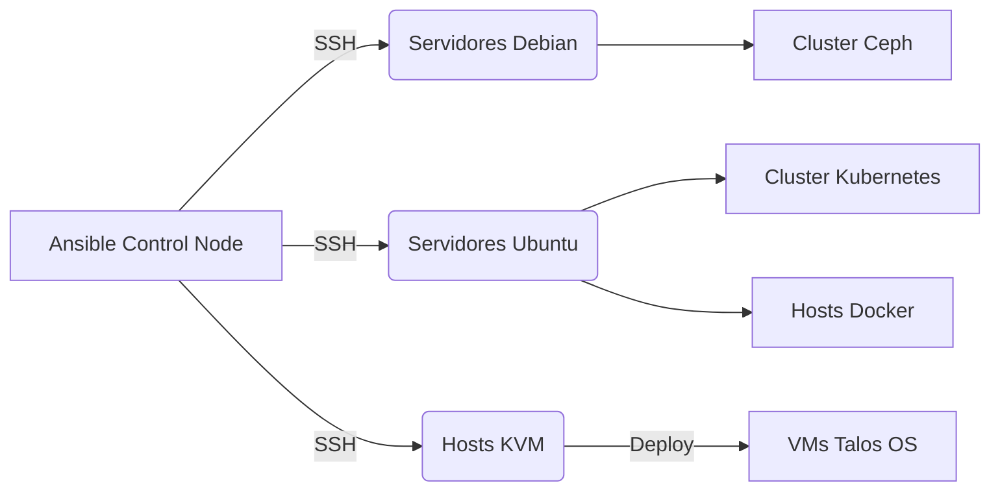

# IaC Ansible - Infrastructure as Code

<div align="center">
  <a href="#español">🇨🇴 Español</a> | 
  <a href="#english">🇺🇸 English</a> | 
  <a href="#português">🇧🇷 Português</a>
</div>

---

<h2 id="español">🇨🇴 Español</h2>

### Descripción del Proyecto
Este proyecto utiliza Ansible para automatizar el aprovisionamiento, configuración y gestión de infraestructura como código (IaC). Está diseñado para desplegar clusters de alta disponibilidad, entornos de virtualización y contenedores en múltiples sistemas operativos.

### Características Principales (🌟)
- **Despliegue de Clusters Kubernetes:** Configuración automatizada de nodos Control Plane y Workers.
- **Virtualización KVM:** Instalación del hypervisor KVM y despliegue automatizado de máquinas virtuales (incluyendo Talos OS v1.7.5 de forma nativa).
- **Almacenamiento Distribuido:** Configuración de clusters Ceph.
- **Gestión de Contenedores:** Instalación y configuración de Docker.
- **Configuración Base y Seguridad:** Hardening de servidores, configuración SSH, redes estáticas, bridges de red y acceso remoto gráfico (VNC/xRDP).
- **Soporte Multi-OS:** Funciona sobre servidores físicos Debian y Ubuntu Server, y aprovisiona máquinas virtuales con Talos OS.

### Arquitectura Técnica de Alto Nivel


### Stack Tecnológico
| Capa | Tecnología | Descripción |
|------|------------|-------------|
| Orquestación | Ansible | Herramienta principal de automatización IaC y ejecución de playbooks. |
| Virtualización | KVM / QEMU | Hypervisor para el despliegue de las máquinas virtuales. |
| OS de Nodos K8s | Talos OS | Sistema operativo inmutable desplegado para clusters de Kubernetes (v1.7.5). |
| OS Soportados | Debian / Ubuntu | Sistemas operativos base gestionados para los servidores físicos. |
| Contenedores | Docker / Kubernetes | Plataformas de orquestación de contenedores instaladas en la infraestructura. |
| Almacenamiento | Ceph | Solución de almacenamiento distribuido configurada vía Ansible. |

### Requisitos Previos
- Ansible 2.9 o superior.
- Python 3.6 o superior en el host de control.
- Acceso SSH configurado a los nodos destino mediante intercambio de llaves (`~/.ssh/id_rsa`).
- Permisos de superusuario (sudo/root) en los servidores destino.

### Instrucciones de Despliegue (🛠️)
1. Clona el repositorio:
   ```bash
   git clone https://github.com/grs89/ansible-1.git
   cd ansible-1
   ```
2. Configura el archivo de inventario `inventory.yml` definiendo las IPs, credenciales y variables de red de tus servidores (grupos `ubuntu_servers`, `debian_servers`, `k8s_servers`, `ceph_servers`).
3. (Opcional) Si usas contraseñas para acceso sudo, crea un archivo Ansible Vault:
   ```bash
   ansible-vault create vault.yml
   ```

### Inicio Rápido
**Ejecutar Configuración Base de Redes y Hardening:**
```bash
ansible-playbook playbooks/site.yml --ask-become-pass
```

**Desplegar VMs de Nodos Talos OS en KVM:**
```bash
ansible-playbook playbooks/deploy_vms.yml
```

**Desplegar Cluster de Kubernetes Completo:**
```bash
ansible-playbook playbooks/deploy_cluster.yml --ask-become-pass
```

### Ejecución de Pruebas
Verificar la conectividad con todos los nodos del inventario:
```bash
# Comprobar el ping en los nodos
ansible all -m ping

# Ver la estructura jerárquica del inventario
ansible-inventory --graph
```

### Licencia
Apache 2.0 License

---

<h2 id="english">🇺🇸 English</h2>

### Project Description
This project uses Ansible to automate the provisioning, configuration, and management of Infrastructure as Code (IaC). It is designed to deploy high-availability clusters, virtualization environments, and container platforms across multiple operating systems.

### Key Features (🌟)
- **Kubernetes Cluster Deployment:** Automated setup of Control Plane and Worker nodes.
- **KVM Virtualization:** Installation of the KVM hypervisor and automated deployment of virtual machines (including native support for Talos OS v1.7.5).
- **Distributed Storage:** Configuration of Ceph storage clusters.
- **Container Management:** Docker installation and configuration.
- **Base Configuration & Security:** Server hardening, SSH setup, static networking, network bridges, and remote graphical access (VNC/xRDP).
- **Multi-OS Support:** Operates on Debian and Ubuntu Server bare-metal environments, and provisions Talos OS virtual machines.

### High-Level Technical Architecture


### Technology Stack
| Layer | Technology | Description |
|-------|------------|-------------|
| Orchestration | Ansible | Core tool for IaC automation and playbook execution. |
| Virtualization | KVM / QEMU | Hypervisor for virtual machine deployment. |
| K8s Node OS | Talos OS | Immutable operating system deployed for Kubernetes clusters (v1.7.5). |
| Supported OS | Debian / Ubuntu | Base operating systems managed on bare-metal servers. |
| Containers | Docker / Kubernetes | Container orchestration platforms installed on the infrastructure. |
| Storage | Ceph | Distributed storage solution configured via Ansible. |

### Prerequisites
- Ansible 2.9 or higher.
- Python 3.6 or higher on the control host.
- SSH access configured to target nodes via key exchange (`~/.ssh/id_rsa`).
- Sudo/root privileges on target servers.

### Deployment Instructions (🛠️)
1. Clone the repository:
   ```bash
   git clone https://github.com/grs89/ansible-1.git
   cd ansible-1
   ```
2. Configure the `inventory.yml` file by defining the IPs, credentials, and network variables of your servers (groups `ubuntu_servers`, `debian_servers`, `k8s_servers`, `ceph_servers`).
3. (Optional) If using sudo passwords, ensure you create an Ansible Vault file:
   ```bash
   ansible-vault create vault.yml
   ```

### Quick Start
**Execute Base Networking and Hardening Configuration:**
```bash
ansible-playbook playbooks/site.yml --ask-become-pass
```

**Deploy Talos OS VMs on KVM:**
```bash
ansible-playbook playbooks/deploy_vms.yml
```

**Deploy Complete Kubernetes Cluster:**
```bash
ansible-playbook playbooks/deploy_cluster.yml --ask-become-pass
```

### Testing
Verify connectivity to all inventory nodes:
```bash
# Check ping on all nodes
ansible all -m ping

# View inventory hierarchical structure
ansible-inventory --graph
```

### License
Apache 2.0 License

---

<h2 id="português">🇧🇷 Português</h2>

### Descrição do Projeto
Este projeto utiliza Ansible para automatizar o provisionamento, configuração e gerenciamento de Infraestrutura como Código (IaC). Foi projetado para implantar clusters de alta disponibilidade, ambientes de virtualização e plataformas de contêineres em múltiplos sistemas operacionais.

### Principais Características (🌟)
- **Implantação de Clusters Kubernetes:** Configuração automatizada dos nós Control Plane e Workers.
- **Virtualização KVM:** Instalação do hypervisor KVM e implantação automatizada de máquinas virtuais (incluindo suporte nativo ao Talos OS v1.7.5).
- **Armazenamento Distribuído:** Configuração de clusters Ceph.
- **Gerenciamento de Contêineres:** Instalação e configuração do Docker.
- **Configuração Base e Segurança:** Hardening de servidores, configuração SSH, redes estáticas, bridges de rede e acesso remoto gráfico (VNC/xRDP).
- **Suporte Multi-OS:** Opera em ambientes bare-metal Debian e Ubuntu Server, e provisiona máquinas virtuais com Talos OS.

### Arquitetura Técnica de Alto Nível


### Stack Tecnológico
| Camada | Tecnologia | Descrição |
|--------|------------|-----------|
| Orquestração | Ansible | Ferramenta principal de automação IaC e execução de playbooks. |
| Virtualização | KVM / QEMU | Hypervisor para a implantação de máquinas virtuais. |
| SO dos Nós K8s | Talos OS | Sistema operacional imutável implantado para clusters Kubernetes (v1.7.5). |
| SO Suportados | Debian / Ubuntu | Sistemas operacionais base gerenciados em servidores bare-metal. |
| Contêineres | Docker / Kubernetes | Plataformas de orquestração de contêineres instaladas na infraestrutura. |
| Armazenamento | Ceph | Solução de armazenamento distribuído configurada via Ansible. |

### Pré-requisitos
- Ansible 2.9 ou superior.
- Python 3.6 ou superior no host de controle.
- Acesso SSH configurado para os nós de destino via troca de chaves (`~/.ssh/id_rsa`).
- Privilégios de superusuário (sudo/root) nos servidores de destino.

### Instruções de Implantação (🛠️)
1. Clone o repositório:
   ```bash
   git clone https://github.com/grs89/ansible-1.git
   cd ansible-1
   ```
2. Configure o arquivo `inventory.yml` definindo os IPs, credenciais e variáveis de rede dos seus servidores (grupos `ubuntu_servers`, `debian_servers`, `k8s_servers`, `ceph_servers`).
3. (Opcional) Se utilizar senhas para o acesso sudo, crie um arquivo Ansible Vault:
   ```bash
   ansible-vault create vault.yml
   ```

### Início Rápido
**Executar Configuração Base de Rede e Hardening:**
```bash
ansible-playbook playbooks/site.yml --ask-become-pass
```

**Implantar VMs Talos OS no KVM:**
```bash
ansible-playbook playbooks/deploy_vms.yml
```

**Implantar Cluster Kubernetes Completo:**
```bash
ansible-playbook playbooks/deploy_cluster.yml --ask-become-pass
```

### Execução de Testes
Verifique a conectividade com todos os nós do inventário:
```bash
# Verificar ping em todos os nós
ansible all -m ping

# Visualizar a estrutura hierárquica do inventário
ansible-inventory --graph
```

### Licença
Apache 2.0 License